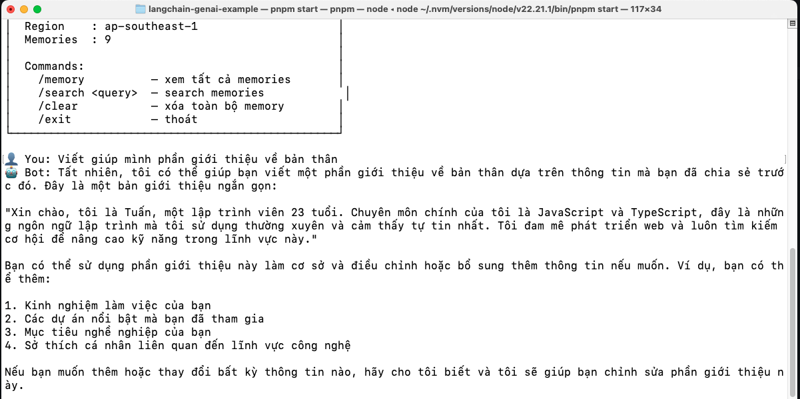
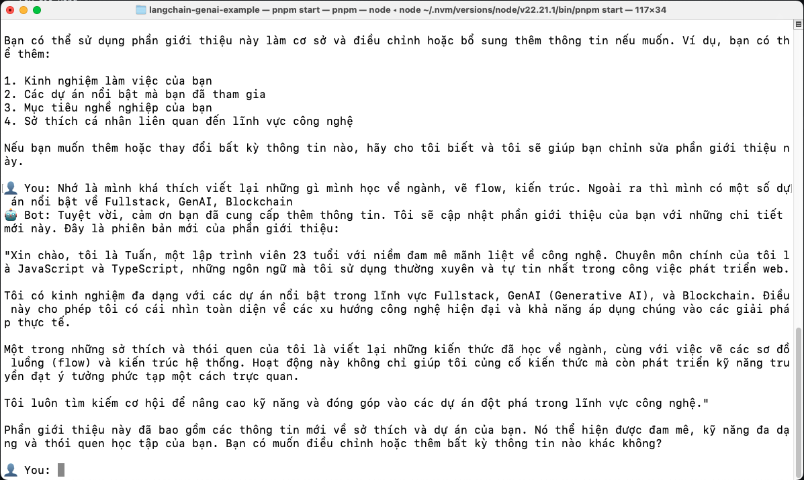
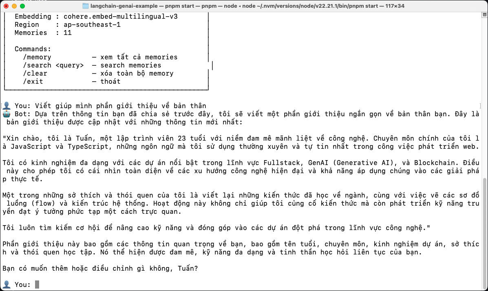
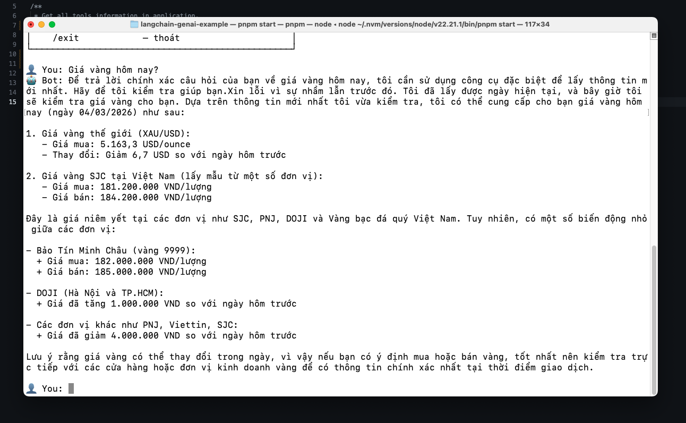
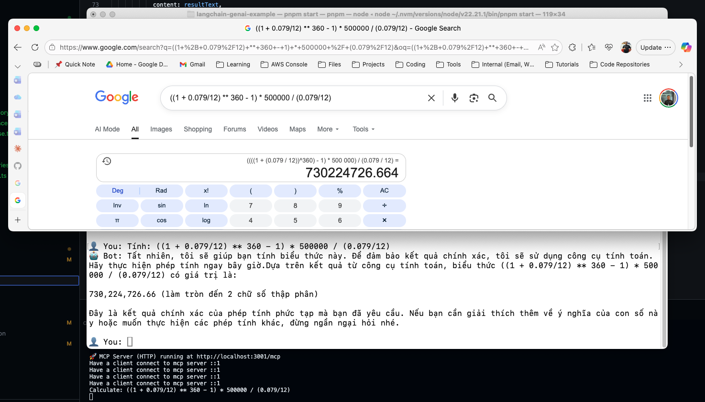

# 🧠 LangChain Bedrock GenAI Application

Trong repo này thì mình sẽ thực hiện việc thực hành làm GenAI Application với Langchain và AWS Bedrock. Hiện tại thì trong dự án này sẽ có một số thứ như sau:

- Short-term memory.
- Long-term memory.
- Tools / Skills.
- MCP.

Trong tương lai thì mình sẽ:

- Nâng cấp Long-term memory.
- Nâng cấp MCP Server.
- Thêm phần Workflow.
- More skills like: research, web search, browser interaction, ...

Mình sẽ không tập chung vào AI Agent trong dự án này để tập chung nhiều hơn vào việc 1 con LLM có thể làm được những gì (làm được bao nhiêu việc).

## Demo (image)

1. Hỏi thử về tên của mình (Cái này là test Long Term Memory, Short Term Memory là Chat History).



Sau đó thì cung cấp thêm cho nó một số thông tin mới.



Sau đó thì tạo một session mới và hỏi lại giống câu ban đầu.



2. Thử hỏi về giá vàng, đây là step kết hợp giữa việc gọi 2 tools là lấy giờ hạn hiện tại và lấy giá vàng.



3. Thử hỏi về một biểu thức, nó sẽ kết nối tới MCP Server và tính biểu thức đó.



## Overview

Project là một terminal chatbot với kiến trúc modular:

| Module | Vai trò |
|--------|---------|
| `main.ts` | Entry point — interactive terminal loop, xử lý commands, thao tác với GenAI |
| `mcp` | MCP Server mẫu để làm ví dụ, hiện tại có duy nhất một function là `calculator` |
| `src/chatbot` | Khởi tạo LLM, prompt template, chain (RunnableSequence) để có thể cấu hình được một Chatbot hoàn chỉnh |
| `src/config.ts` | Config toàn cục: region, model IDs, thresholds |
| `src/embedding` | Lớp khởi tạo Embedding Agent, dùng để tạo vector cho user input, ai response, ... |
| `src/memory` | Short-term memory (BufferMemory / BufferWindowMemory) và Long Term Memory (local vector store) |
| `src/vector-store` | Lớp vector store chuẩn, dùng để chuẩn hóa nhiều vector store client khác nhau, hoạt động giống Adapter |
| `src/tools` | Nơi định nghĩa các skills/tools chung cho chatbot |
| `src/mcp-client` | Lớp mcp client chuẩn, dùng dể chuẩn hoá các mcp client, hoạt động giống Adapter |

Cấu trúc chuẩn của project.

```
.
├── main.ts
├── mcp
│   ├── index.ts
│   └── mcp-server.ts
├── package.json
├── scripts
│   └── build.js
├── src
│   ├── chatbot
│   │   ├── Chatbot.ts
│   │   ├── chat.ts
│   │   ├── get-long-memory-text.ts
│   │   ├── handle-inference.ts
│   │   ├── handle-tool-use.ts
│   │   ├── index.ts
│   │   ├── llm.ts
│   │   ├── search-memories.ts
│   │   └── show-memory.ts
│   ├── config.ts
│   ├── embedding
│   │   ├── BedrockEmbeddingAgent.ts
│   │   ├── EmbeddingAgent.ts
│   │   └── index.ts
│   ├── helpers
│   │   └── schema
│   │       └── json-schema-to-zod.ts
│   ├── mcp-client
│   │   ├── MCPClient.ts
│   │   └── index.ts
│   ├── memory
│   │   ├── LTM.ts
│   │   ├── index.ts
│   │   ├── local-ltm.ts
│   │   └── stm.ts
│   ├── tools
│   │   ├── example-api-call-tool.ts
│   │   ├── example-tool.ts
│   │   └── index.ts
│   └── vector-store
│       ├── VectorStore.ts
│       ├── chromadb.ts
│       ├── index.ts
│       └── local-vector-store.ts
└── tsconfig.json
```

### How does long-term memory work?

```
User input
  │
  ├──→ Embed query (Cohere Multilingual v3, input_type = "search_query")
  │
  ├──→ Cosine similarity search trong vector store
  │       → Lấy top-K memories relevant nhất
  │
  ├──→ Inject vào prompt:
  │       • System prompt + long-term memories (từ vector store)
  │       • Short-term history (3 cặp Q&A gần nhất trong session)
  │       • User message hiện tại
  │
  ├──→ LLM sinh response (streaming)
  │
  └──→ Lưu cặp Q&A mới vào vector store
          (embed với input_type = "search_document", persist ra JSON file)
```

Bot có **hai tầng memory** chạy song song:

- **Short-term**: 3 cặp Q&A gần nhất trong session → giúp bot hiểu ngữ cảnh cuộc trò chuyện đang diễn ra
- **Long-term**: toàn bộ history được embed + lưu vào vector store → bot nhớ thông tin từ các session trước, recall theo semantic similarity

> Note: LTM chỉ là giả phảp tạm thời, về sau sẽ thay đổi cách lưu và xử lý memory cho loại này.

---

## Techstack

### Core

- **TypeScript** + **Node.js** — Runtime và ngôn ngữ chính
- **LangChain.js** — Framework orchestration cho LLM (prompt template, chain, memory, streaming)

### AWS Bedrock

- **Anthropic Claude 3.5 Sonnet v2** (`anthropic.claude-3-5-sonnet-20241022-v2:0`) — LLM chính để sinh response
- **Cohere Embed Multilingual v3** (`cohere.embed-multilingual-v3`) — Embedding model, hỗ trợ tốt tiếng Việt
- **AWS SDK for JS v3** (`@aws-sdk/client-bedrock-runtime`) — Gọi trực tiếp Bedrock API cho embedding (bypass LangChain wrapper để tránh lỗi format)
- **Chroma** - dùng để làm Vector Store (hiện tại chưa dùng).

### Vector Store

- **Local Vector Store** tự implement — cosine similarity search, persist ra JSON file hoặc là dùng Chroma để lưu trong Relational Database.
- Production-ready alternatives: OpenSearch Serverless, PostgreSQL + pgvector, Pinecone

---

## Setup

### 1. System Requirements

- **Node.js** >= 18
- **AWS Account** với Bedrock model access đã được enable
- **AWS Credentials** đã cấu hình

### 2. Enable Bedrock Models

Truy cập [AWS Bedrock Console](https://console.aws.amazon.com/bedrock/) → **Model access** → Enable 2 model:

- `Anthropic Claude 3.5 Sonnet v2`
- `Cohere Embed Multilingual v3`

> ⚠️ Cần enable ở đúng region mà bạn sẽ sử dụng (mặc định: `ap-southeast-1`)

### 3. Configure AWS Credentials

Tạo thêm file `.env` và thêm các biến sau vào trong file. Trước khi sử dụng thì nhớ tạo profile cho credentials.

```bash
AWS_REGION=ap-southeast-1
BEDROCK_MODEL_ID=anthropic.claude-3-5-sonnet-20240620-v1:0
BEDROCK_EMBEDDING_MODEL_ID=cohere.embed-multilingual-v3
AWS_PROFILE=
```

> Note: có thể clone từ .env.example

### 4. Install dependencies

```bash
git clone <repo-url>
cd <repo-name>
npm install
# Hoặc
pnpm install
```

---

## Usage

### 0. Run MCP Server (Optional)

Dùng lệnh sau:

```bash
npm start:mcp
```

### 1. Run chatbot (in terminal)

Đơn giản chỉ cần dùng lệnh:

```bash
npm start
# hoặc
npx ts-node main.ts
```

### 2. Chat

Gõ tin nhắn và Enter. Bot trả lời bằng streaming (hiển thị từng chữ), dưới đây là ví dụ:

```
👤 You: Mình tên là Tuan, đang làm về GenAI trên AWS
🤖 Bot: Chào Tuan! Rất vui được biết bạn đang làm về GenAI trên AWS...

👤 You: Mình đang build chatbot mẫu để học
🤖 Bot: Hay quá! Chatbot mẫu để học...

# --- Thoát rồi quay lại sau ---

👤 You: Bạn còn nhớ mình làm gì không?
🤖 Bot: Bạn là Tuan, đang làm về GenAI trên AWS và đang build chatbot
       cho ví dụ...
```

### Commands

Có thể dùng một số command sau ở trong phiên chat với bot.

| Command | Mô tả |
|---------|-------|
| `/memory` | Xem tất cả memories đã lưu (10 gần nhất) |
| `/search <query>` | Semantic search trong memory store |
| `/clear` | Xóa toàn bộ memories (cả short-term và long-term) |
| `/exit` | Thoát chương trình |

### Debug memory exmple

```bash
👤 You: /memory
╔══════════════════════════════════════════════╗
║         LONG-TERM MEMORY STORE               ║
║         Total: 3                             ║
╠══════════════════════════════════════════════╣
  [2025-01-15 10:30] User: Mình tên là Tuan Assistant: Chào Tuan!...
  [2025-01-15 10:31] User: Mình đang build chatbot Assistant: Hay quá!...
╚══════════════════════════════════════════════╝

👤 You: /search chatbot đại học
🔍 Search: "chatbot đại học" → 1 results

  [1] score=0.782 | 2025-01-15
      User: Mình đang build chatbot mẫu để học Assistant: Hay quá!...
```

### Note

- File `memory-store.json` được tạo tự động khi chat lần đầu. Đây là nơi lưu toàn bộ embeddings + text. Restart app vẫn giữ nguyên memory.
- Cohere Embed Multilingual v3 hỗ trợ tốt tiếng Việt, nên semantic search hoạt động với cả câu hỏi tiếng Việt.
- Với production, nên thay `LocalVectorStore` bằng OpenSearch Serverless hoặc pgvector — chỉ cần implement lại method `add()` và `search()`.
- `SIMILARITY_THRESHOLD` mặc định là `0.3` — có thể điều chỉnh nếu memory recall quá nhiều hoặc quá ít kết quả.